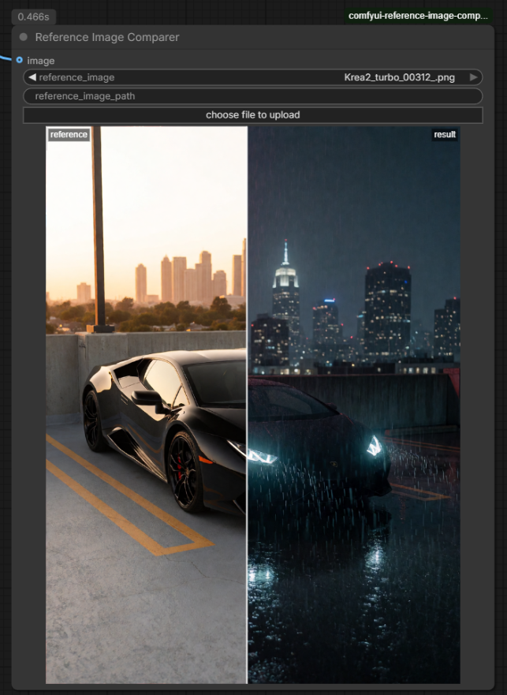

# ComfyUI Reference Image Comparer

Compare your workflow's output against a fixed reference image, right in the
node graph. A single node — **Reference Image Comparer** (category: `image`) —
shows both images in one preview with a hover swipe slider: left of the line
is your reference, right is the freshly generated result. Useful for A/B-ing
prompt tweaks, sampler settings, or model changes against a known baseline
without leaving ComfyUI.

## Usage

1. Add **Reference Image Comparer** to your workflow.
2. Pick the reference with the `reference_image` picker (uploads go to
   ComfyUI's `input` folder), **or** paste an absolute path into
   `reference_image_path` (the path overrides the picker when non-empty).
3. Connect your generated image to the `image` input.
4. Run the workflow, then hover over the preview to swipe between the two
   images (click-dragging works too).

The node re-runs automatically if the reference image file changes on disk,
and the reference side of the preview updates as soon as you pick a different
file — no run needed.

## Credits

UI concept inspired by the Image Comparer node from
[rgthree-comfy](https://github.com/rgthree/rgthree-comfy) (MIT).

## License

[MIT](LICENSE)
